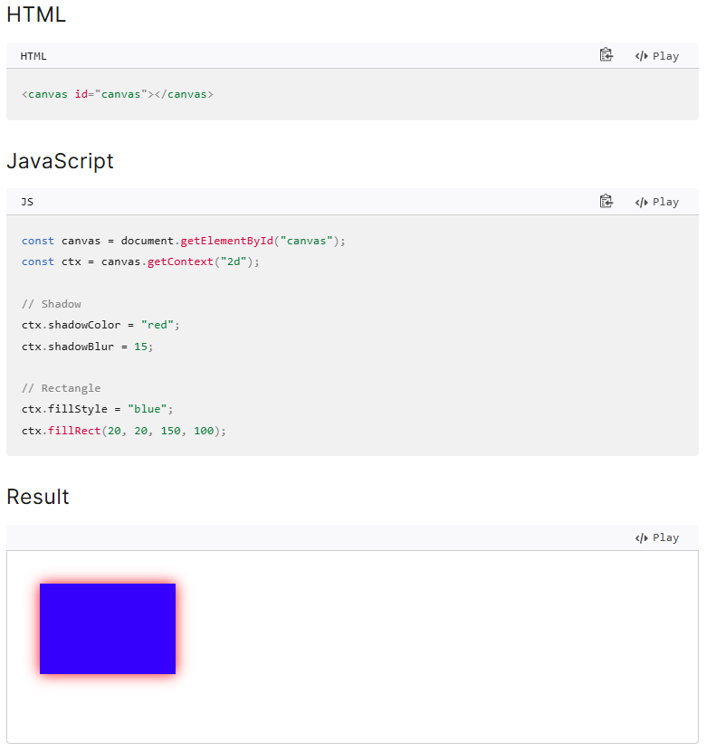

# yhou0161_9103_Quiz8
Design research for my major assignments

## Imaging Technique Inspiration
We wanted to recreate Piet Mondrian's ‘Broadway Boogie Woogie’, which has a distinctive artistic style and is still used today in clothing and shoes. Now we want to combine ‘Broadway Boogie Woogie’ with a video game called Pac-Man, which is a wonderful combination of an old artwork and a modern classic.

As there are many similarities in the layout of the two works, it provides us with the possibility of fusion. We will create the walls from Pac-Man in the style of Mondrian's work and inherit the cyberpunk-inspired colour palette from Pac-Man. Also in Mondrian's work there are mostly lines and rectangles, whereas in Pac-Man the circle is an important element, so the inclusion of the circle is also necessary.

## Coding Technique Exploration
The neon effect is important in order to achieve the cyberpunk style colours described above. So I will use the glow effect to make some of the colours have a glow effect. shadowBlur and shadowColor are two functions from CanvasRenderingContext2D. ShadowBlur can be assigned a value for the blur, the higher the value the higher the blur. Then the graphic can be rendered with a halo effect.

In addition to this, there are shadowOffsetX and shadowOffsetY to change the position of the shadow. So I would also consider making the mouse a light source to change the direction of the shadows and halos when creating interactive gives. You can also see in the example that the author used map() to lock the mouse position.

[Glow effect 1:40](https://www.youtube.com/watch?v=iIWH3IUYHzM&ab_channel=KazukiUmeda)